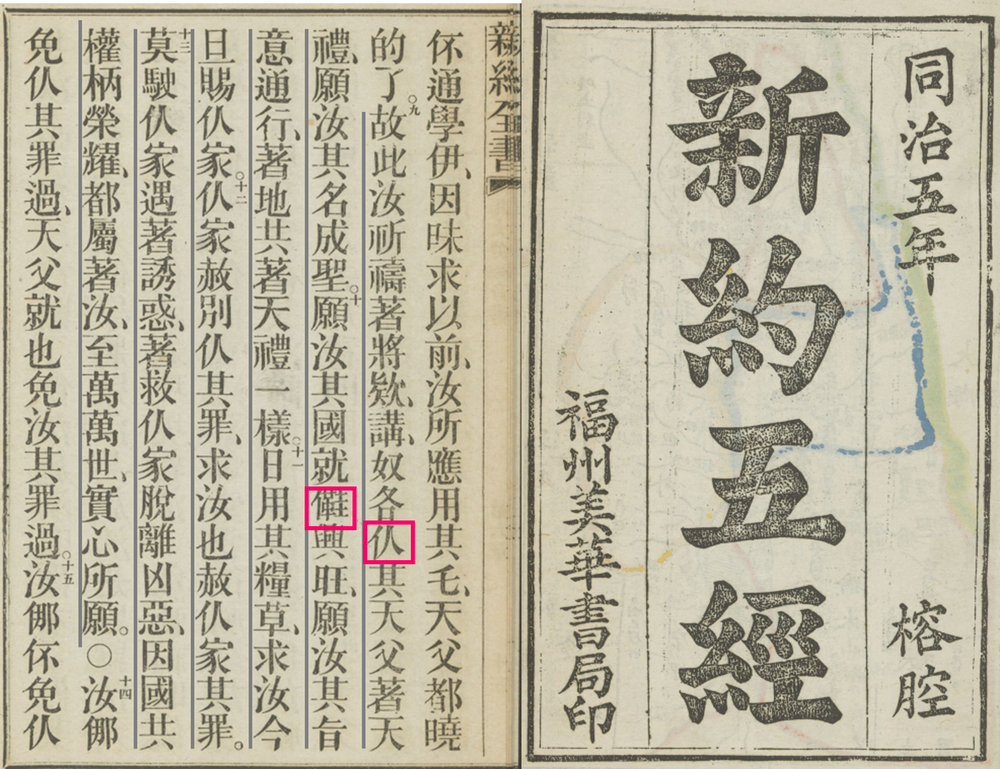
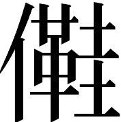

**馬祖語罕見字測試**：

煮菜使許蠻侈油（原馬報文字）  煮菜使許蠻𡖯油（直接引用全字庫「𡖯」字）  煮菜使許蠻油（將「𡖯」作加粗處理以配合其他字型）

------------------------------------------------------------------------

台灣儂嘴野?(饞)！（原馬報文字）  台灣儂嘴野𩞫！（直接引用全字庫「𩞫」字）  台灣儂嘴野！（將「𩞫」作加粗處理以配合其他字型）

------------------------------------------------------------------------

華語：可不可以? 可以不?（否定詞放中間或尾端均可）  馬祖語（以前寫法）：使儥? 儥使?  馬祖語（現在寫法）：會使? 會使?  台語：會使袂?（台語似乎沒有「會袂使」的說法）

{fig-align="left" width="75%"}

莫積錢財落地禮，只塊務蠧魚蛀，會[生鍟黯腐]{.underline-gray}，賊也會開退偷去。㑚積錢財落天禮，許塊毛蠧魚蛀，賣生鍟黯腐，賊也賣開退偷去。因汝錢財著冬那，汝心緒也著冬那。（耶穌登山寶訓）  生鍟黯腐：現寫作「生鉎黯腐」，生銹腐爛的意思。

<!-- 𡖯、儥、仈、𩞫、𣍐、𩸞、俤…… -->

<!-- 、'。、、後面、、、俤 -->

<!-- 汝各雖然莽呆，都曉的拈好乇乞仔，就汝其天父，更更將好乇賜乞求伊其阿。 -->

<!-- 我就明明共伊講，作呆惡其，我八汝，著離我去。 -->

<!-- ::: {.scripture-align} -->

<!-- 原文：汝各雖然莽呆，都曉的拈好乇乞仔，就汝其天父，更更將好乇賜乞求伊其其阿。 -->

<!-- 我就明明共伊講，作呆惡其，我八汝，著離我去。 -->

<!-- ::: -->

<!-- ::: {.scripture-align} -->

<!-- 原文：莫積錢財落地禮，只塊務蠧魚蛀，會[生鍟黯腐]{.underline-gray}，賊也會開退偷去。㑚積錢財落天禮，許塊毛蠧魚蛀，賣生鍟黯腐，賊也賣開退偷去。因汝錢財著冬那，汝心緒也著冬那。 -->

<!-- ::: -->
