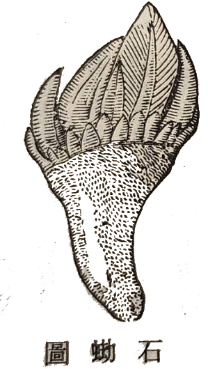
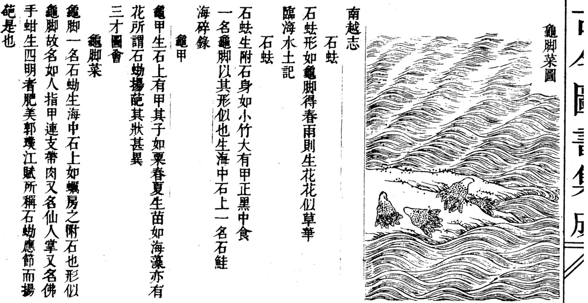

馬祖列島盛產海味，其中一種長在礁岩縫隙間的甲殼貝類有各式不同的稱呼 - 龜爪、龜足（因其附著岩石的褐色基座類似烏龜的腳），[^1]有稱之為佛手，因其豎立起來像人的雙手合掌（從龜足到佛手的反差還挺大），也有稱作海瓜子，因為它的吃法有點像嗑瓜子；但一般島民更愛以馬祖閩東語稱其為「筆架」，緣於其帶有硬殼、高低起伏的輪廓，形似擱置毛筆的筆架。筆架無論水煮、清炒或炒酒糟，都極美味，堪屬佐酒佳餚。

[^1]: 馬祖東引、莒光的居民多用此名。因為音變的關係，鄉親說成ㄍㄨㄧˋ ㄘㄨㄛㄏˊ(kuiˋ tshuohˊ)，若以國字呈現，反而接近「龜尺」。https://www.youtube.com/watch?v=qzQinPI50mg&t=31s

其實這種甲殼貝類在中國古籍上記載的名稱是「石蜐」(䂶：音結)，而南朝文學家江淹（江文通，444-505）還曾寫過一篇吟詠石䂶的《石蜐賦》，較之龜爪、龜足或其他名稱，似乎瞬間「逼格驟升」（你能想像《龜足賦》、《龜爪賦》這樣的賦名嗎?）。江淹以擬人手法，將石䂶比作海神的臣子，描寫它在大海中的生存狀態——雖具靈性卻隱沒不彰、生命微弱。賦的最後表達了一種無奈：既然在自然中難以保全，不如被人食用，成為公子席上的佳餚，也算是另一種價值的實現。全賦寓有身世之感，借物抒懷。

::::::: {layout="[20, -10, 70]" layout-valign="bottom"}
:::: {#col-left}

::: {style="text-align: center;"}
\(a\)
:::
::::

:::: {#col-right}
{style="border: 2px solid #ccc;"}

::: {style="text-align: center;"}
\(b\)
:::
::::
:::::::

石䂶(a) 辭海字典(1990中華書局)所繪之石䂶圖；(b) 古今圖書集成中的石䂶相關文獻。

江淹你或許不熟，但你必然聽過「江郎才盡」這句成語。沒錯，江淹就是江郎。江淹以詩賦聞名，並以「賦」最為世人稱道。據說江淹晚年曾在夢中遇見東晉文學家郭璞（276—324），郭向他索取先前借給他的「五色筆」。江淹從懷中掏出彩筆歸還，此後，他的文章便大不如前，再無昔日光芒，此即「江郎才盡」的典故。[^2]

[^2]: 南朝梁鍾嶸《詩品·齊光祿江淹》，其記載如下：「初，淹罷宣城郡，遂宿冶亭，夢一美丈夫，自稱郭璞，謂淹曰：『我有筆在卿處多年矣，可以見還。』淹探懷中，得五色筆以授之。爾後為詩，**不復成語，故世傳江淹才盡**。」

一邊是形如「筆架」的石蜐，一邊是江淹夢中交出的「五色筆」。彷彿江淹在早年寫下這篇賦時，就已經為自己晚年那支無處安放的彩筆，預備好了一個宿命的歸宿。

然而，江淹在《石蜐賦》裡，寫的並非微小生物與狂風巨浪搏鬥的悲壯，而是一種極度卑微、甚至帶點黑色幽默的生存無奈。
他在賦中化身為石蜐，暗自慶幸自己既沒有「文豹」那種會惹來殺身之禍的華麗皮毛，也沒有「珠蛤」那種會誘發人類貪婪的閃耀珍珠（比文豹而無恤，方珠蛤而自寧）。為了活命，牠選擇藏拙，把光芒隱藏，將智謀深埋（光避伏而不耀，智埋冥而難發），只求能躲在荒涼的海濱，藉著波濤掩蓋自己的蹤跡。

這正是早年江淹的寫照。出身貧寒的他，在門閥森嚴、動輒族誅的南朝政局中，猶如一隻生長在險礁上的石蜐。他深知才華可能是催命符，因此極力想要隱藏鋒芒、明哲保身。但他內心深處的恐懼、幽憤與不平，卻又逼得他不得不提筆，化作了《恨賦》、《別賦》等驚才絕豔的千古名篇。那些文字，是他在政治駭浪中壓抑求生的低語。

但《石蜐賦》最無情的反轉在於結局：無論石蜐怎麼躲藏，終究逃不過被採集食用的命運。
在賦的末段，石蜐放棄了掙扎，發出一聲長嘆：「算了罷！（已矣哉）」既然難逃一死，那就離開窮苦海人的偏僻住處，去當貴公子宴席上的貴客吧。最後，江淹寫下了一句極具穿透力的讖語：「儻委身於玉盤，從風雨而可惜。」——如果最終註定要被剝下外殼，盛裝在華麗的玉盤之上，那我之前在海上辛辛苦苦捱過的那些風雨，真是太可惜、太不值了啊。

這句「從風雨而可惜」，完美且殘酷地預言了江淹的後半生。

當江淹歷經宋、齊、梁三朝不倒，官至金紫光祿大夫，過上鐘鳴鼎食的奢華生活時，他終於坐上了那只權力的「玉盤」。美國當代傳記大師羅伯特·卡羅曾說：「權力並不總是使人腐化，但權力總是能揭露本質（Power always reveals）。」這句話宛如一把利刃，剖開了「江郎才盡」的神話外衣。
江淹的才華並沒有被神仙收走，而是玉盤的安逸與權力，揭露了他的本質。

骨子裡，他終究是一個渴望世俗成功的實用主義者。困頓時的驚世才情，不過是他為了脫貧求生、攀爬階級的工具；一旦他成功抵達了頂點，成為了體制內的「嘉客」，這項工具便失去了意義。更何況，在血腥的官場裡，繼續展露刺目的才華，只會惹禍上身。當他發現自己終於可以安穩地躺在玉盤上時，回首早年那些因恐懼和悲憤而寫下的泣血之作，或許他真的會覺得「從風雨而可惜」——早知道能有今日的榮華富貴，當初又何必寫得那麼辛苦、那麼鋒芒畢露呢？

他並沒有在夢裡把五色筆還給郭璞。他是清醒地、主動地，將那支曾經寫盡人間離愁的筆，擱置在了權勢與安逸雕琢而成的「筆架」之上，再也沒有拿起來。

馬祖海邊那被稱作筆架的石蜐，依然在礁岩上靜靜看著潮起潮落。而江文通的一生則留下了一個冷酷的文學寓言：當一個曾躲在風雨中咬牙苦撐的靈魂，最終選擇向世俗的玉盤徹底妥協時，他不再需要才華，世人咀嚼的，只剩下一具名為「才盡」的華麗空殼。
